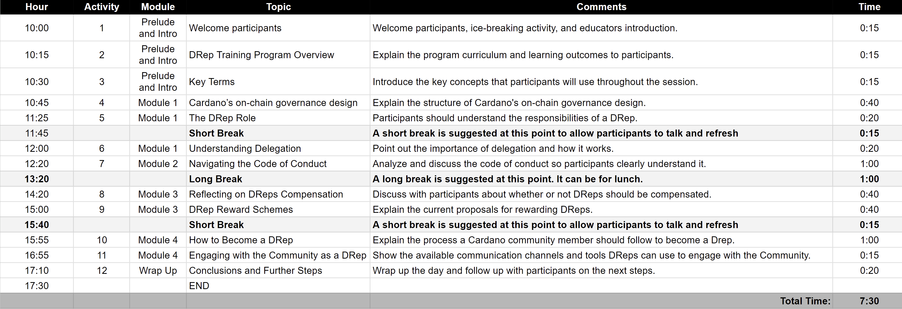

## Proposed Schedule

This lesson contains 12 activities covering all the DRep program content. In addition to these activities, instructors should consider breaks throughout the day according to the local culture and manners, such as lunchtime and refreshments that can be offered in the training session.

The following table shows a proposed schedule for a typical training session, with lunchtime around 1:00 p.m. Feel free to adapt the schedule and activity timing accordingly to your audience and local culture.

